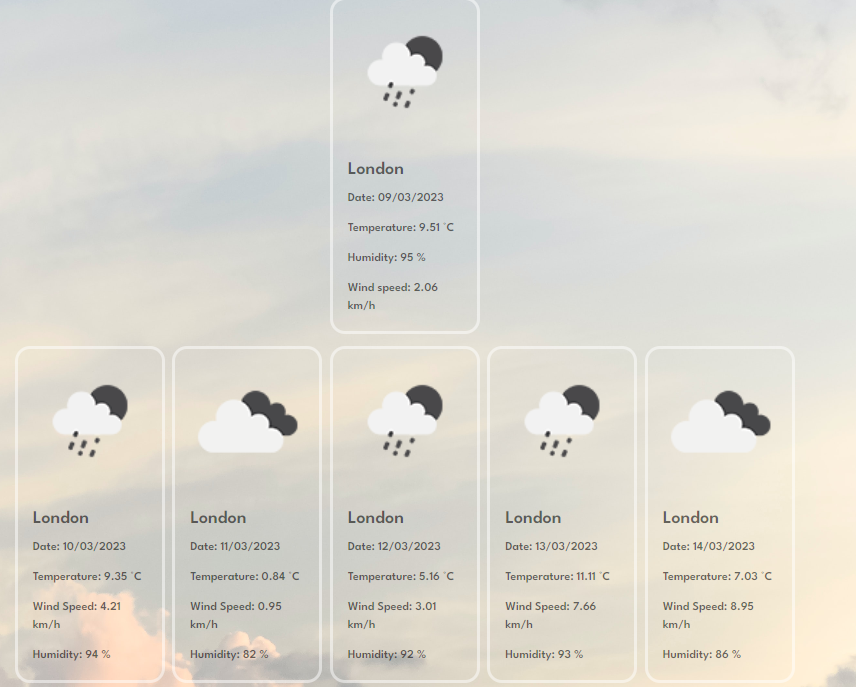

# Weather Forcast Application
## Description 
 Application allows to gather up-to-date weather information for choosen location, including current conditions,  and five days forecast. User-friendly interface allows to easily search for any location and store search history.
## Table of Content

1. [Description](#description)
2. [Installation](#installation)
3. [Usage](#usage)
4. [Contribution](#contribution)
5. [Repository](#repository)
6. [Deployment](#deployment)
7. [Licence](#licence)
8. [Questions](#questions)

## Installation 
Application works on any website browser.  

## Usage 
To use application please provide choosen location to input field, and click `Sarch` button.

Application will render 2 rows of 6 tiles in total. 
Top tile represent today's weather conditions.
Followed by five elements with data for next five days.

Today's weather contain: temprature, humidity, wind speed with appropriate SI base unit.

Application will store and display user search history. Created buttons can be used to more efficient navigation between searched cities.

## Contribution 
Contribution is not available at this moment. Please check for further updates.

## Repository 

Repository link: [https://github.com/WloMac/Weather-Forecast](https://github.com/WloMac/Weather-Forecast)

## Deployment 
Deployed website: [https://wlomac.github.io/Weather-Forecast/](https://wlomac.github.io/Weather-Forecast/)

## License 

## Questions  
[WloMac](https://github.com/WloMac)

If you have any further questions about this README Generetor do not hesitate to contact using this e-mail address: wmac.webdev@gmail.com

